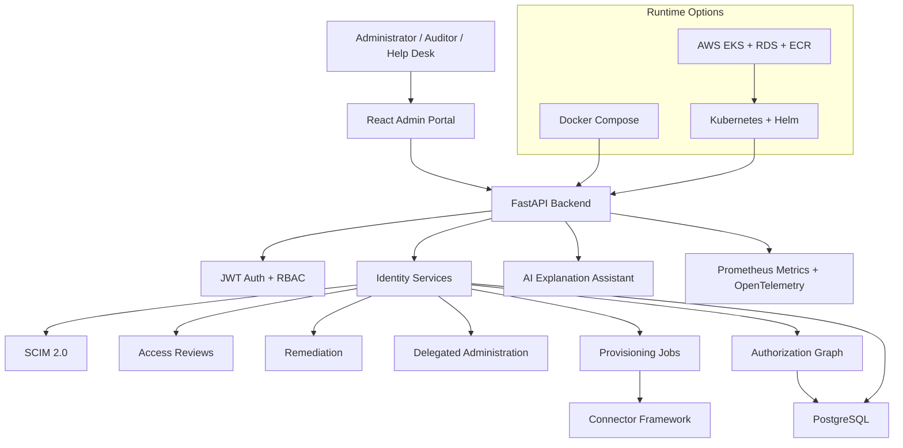

# AccessIQ

AccessIQ is a cloud-native Identity Governance and Administration platform for
demonstrating enterprise identity lifecycle management, SCIM 2.0 provisioning,
access reviews, remediation workflows, delegated administration, AI-assisted
explainability, Kubernetes packaging, Terraform-based AWS infrastructure, and
modern DevOps practices.

The project is designed as a portfolio-grade, end-to-end identity security
platform. It shows how backend identity services, frontend administration
workflows, infrastructure-as-code, observability, CI/CD, performance validation,
and security hardening fit together in one deployable system.

## Development Note

AccessIQ was built as an AI-assisted software engineering project using ChatGPT
and Codex.

ChatGPT was used to help shape the project roadmap, define milestones, and
generate detailed implementation prompts. Codex was used to implement the
codebase iteratively from those prompts. My role was to guide the project
direction, review the generated plans and prompts, run the application, perform
manual testing, troubleshoot issues, and validate that each milestone worked as
intended.

This project demonstrates how AI-assisted development workflows can be used to
build and iterate on a full-stack identity security platform, including backend
APIs, frontend workflows, CI/CD, Docker, Kubernetes, Terraform, AWS deployment,
observability, performance validation, and security readiness.

## Feature Highlights

| Area | What AccessIQ Demonstrates |
| --- | --- |
| Identity lifecycle | User, group, application, entitlement, and access-assignment modeling |
| SCIM 2.0 | User and group read/provisioning APIs, PATCH support, filtering, sorting, pagination, and enterprise user attributes |
| Access reviews | Certification campaigns, review items, review decisions, and governance evidence |
| Remediation | Remediation jobs, policy-aware revoke flows, and audit history |
| Delegated administration | Scoped administration rules for help desk and delegated operators |
| Authorization graph | Evidence-backed graph views across users, groups, apps, access, reviews, remediation, and provisioning |
| AI explanation assistant | Context assembly and provider-backed identity explanations with mock, OpenAI, and Anthropic support |
| Connector framework | Mock Salesforce, GitHub, Zendesk, and finance connectors with orchestration and retry behavior |
| Provisioning jobs | Request tracking, execution history, connector dispatch, and audit logging |
| Observability | Structured logs, correlation IDs, health checks, Prometheus metrics, OpenTelemetry hooks, Grafana dashboard assets, and k6 tests |
| Cloud native | Docker Compose, Kubernetes, Helm, Terraform, AWS EKS/RDS/ECR/IAM/Secrets Manager, and GitHub Actions |
| Security readiness | RBAC, JWT auth, security headers, Gitleaks, Trivy, dependency audits, SBOM generation, threat model, and production checklist |

## Architecture



## Deployment Decision Guide

| Path | Best For | What You Get |
| --- | --- | --- |
| Docker Compose | Fast local demo and development | Backend API, PostgreSQL, and Vite frontend on localhost |
| Local Kubernetes | Helm and cluster validation | Backend, frontend, PostgreSQL, Services, Ingress resources, probes, and Kubernetes hardening checks |
| AWS/EKS | Production-style cloud deployment | Terraform AWS foundations, ECR image publishing, EKS Helm deployment, rollout checks, and smoke tests |

## Prerequisites

| Tool | Needed For | Notes |
| --- | --- | --- |
| Git | Clone and version control | Required for all paths |
| Docker Desktop | Docker Compose, image builds, local Kubernetes | Enable Kubernetes for the local Helm path |
| Python 3.12 | Local backend development and tests | Docker Compose does not require a host Python environment |
| Node.js 22 | Local frontend development and validation | Docker builds install frontend dependencies inside the image |
| Helm 3 | Kubernetes deployment | Required for local Kubernetes and AWS/EKS deployment |
| kubectl | Kubernetes verification and port-forwarding | Must point at Docker Desktop, kind, minikube, or EKS |
| Terraform | AWS infrastructure | Required for AWS infrastructure provisioning |
| AWS CLI | AWS/EKS deployment | Required for AWS credentials, EKS kubeconfig, and deployment operations |
| k6 | Optional performance validation | Can also run through Docker |

## Deployment Quick Start

### Option 1: Local Docker Compose

Use this path when you want the fastest way to run the full application locally.

Prerequisites:

- Git
- Docker Desktop

Clone the repository:

```bash
git clone https://github.com/happelj/accessiq.git
cd accessiq
```

Copy the example environment file if you want local overrides:

```bash
cp .env.example .env
```

Start the stack:

```bash
docker compose up --build
```

Open the application:

| Resource | URL |
| --- | --- |
| Frontend login | `http://localhost:5173` |
| Backend API | `http://localhost:8000` |
| Swagger UI | `http://localhost:8000/docs` |
| Health check | `http://localhost:8000/health` |
| Metrics | `http://localhost:8000/metrics` |

Default seeded demo credentials:

| User | Email | Password | Role |
| --- | --- | --- | --- |
| Alice Johnson | `alice@example.com` | `Password123!` | `security_admin` |
| Ian Wright | `ian@example.com` | `Password123!` | `iam_admin` |
| Sarah Chen | `sarah@example.com` | `Password123!` | `helpdesk` |
| Audit Reviewer | `auditor@example.com` | `Password123!` | `auditor` |
| Bob Smith | `bob@example.com` | `Password123!` | `employee` |

These credentials are development seed data only. Do not use them in a real
deployment.

Useful Docker checks:

```bash
docker compose ps
docker compose logs api
docker compose exec -T api pytest -vv
```

### Option 2: Local Kubernetes

Use this path when you want to validate the Helm chart and Kubernetes deployment
locally.

Prerequisites:

- Docker Desktop with Kubernetes enabled, kind, or minikube
- Helm
- kubectl

Build images that the local cluster can access:

```bash
docker build -t accessiq-api:latest .
docker build -t accessiq-frontend:latest frontend
```

Install or upgrade the Helm release:

```bash
helm upgrade --install accessiq helm/accessiq \
  --namespace accessiq-dev \
  --create-namespace \
  -f helm/accessiq/values-dev.yaml
```

Check the deployment:

```bash
kubectl -n accessiq-dev get pods
kubectl -n accessiq-dev get services
kubectl -n accessiq-dev get ingress
```

Port-forward the frontend and backend:

```bash
kubectl -n accessiq-dev port-forward svc/accessiq-frontend 8080:80
kubectl -n accessiq-dev port-forward svc/accessiq-backend 8000:8000
```

Open:

| Resource | URL |
| --- | --- |
| Frontend login | `http://localhost:8080` |
| Backend API | `http://localhost:8000` |
| Swagger UI | `http://localhost:8000/docs` |
| Health check | `http://localhost:8000/health` |

Run the Helm test:

```bash
helm test accessiq --namespace accessiq-dev
```

If pods show `ImagePullBackOff`, rebuild the local images with the exact tags
shown above or push images to a registry reachable by your cluster. For more
details, see [Kubernetes and Helm](docs/kubernetes.md).

### Option 3: AWS Deployment

Use this path when you want to deploy AccessIQ in a production-style AWS
environment.

AWS deployment is intentionally split into infrastructure and application
deployment steps:

```text
1. Terraform infrastructure
   -> VPC, EKS, managed node groups, RDS, ECR, IAM, and Secrets Manager placeholders

2. Remote state
   -> S3 backend bootstrap and environment-specific Terraform state

3. GitHub Actions deployment
   -> OIDC role assumption, image builds, ECR push, digest lookup, and kubeconfig

4. Helm deployment
   -> EKS release using helm/accessiq/values-aws.yaml and runtime overrides

5. Smoke tests
   -> Health, Swagger/OpenAPI, login, version, frontend, and optional HTTPS checks
```

Start with these documents:

- [AWS infrastructure](docs/aws.md)
- [Terraform workflow](docs/terraform.md)
- [AWS deployment](docs/deployment-aws.md)

Important AWS notes:

- Terraform provisions infrastructure. It does not automatically deploy the app.
- The GitHub Actions AWS deployment workflow is manual, not automatic on every push.
- Real AWS deployment can create billable resources, especially EKS, NAT Gateway, and RDS.
- Review [AWS cleanup guidance](docs/aws.md#cleanup) before running `terraform apply`.

## Project Structure

```text
accessiq/
  app/                         FastAPI backend, identity services, SCIM, AI, graph, governance
  frontend/                    React, Vite, TypeScript admin portal
  tests/                       Backend pytest suite
  helm/accessiq/               Helm chart for local Kubernetes and EKS
  infrastructure/terraform/    AWS infrastructure modules and dev/prod environments
  docs/                        Architecture, deployment, security, and feature documentation
  performance/k6/              k6 performance and metrics validation scripts
  scripts/                     Smoke tests, dependency audit, SBOM, secret scan, container scan
  .github/workflows/           CI and manual AWS deployment workflows
```

## Documentation

| Topic | Link |
| --- | --- |
| Architecture | [docs/architecture.md](docs/architecture.md) |
| Frontend | [docs/frontend.md](docs/frontend.md) |
| CI/CD quality gates | [docs/ci-cd.md](docs/ci-cd.md) |
| Kubernetes and Helm | [docs/kubernetes.md](docs/kubernetes.md) |
| AWS infrastructure | [docs/aws.md](docs/aws.md) |
| AWS deployment | [docs/deployment-aws.md](docs/deployment-aws.md) |
| Terraform workflow | [docs/terraform.md](docs/terraform.md) |
| Release engineering | [docs/releases.md](docs/releases.md) |
| Observability | [docs/observability.md](docs/observability.md) |
| Performance validation | [docs/performance.md](docs/performance.md) |
| Security and production readiness | [docs/security.md](docs/security.md) |
| Threat model | [docs/threat-model.md](docs/threat-model.md) |
| SCIM implementation | [docs/scim.md](docs/scim.md) |
| Connector framework | [docs/connectors.md](docs/connectors.md) |
| Provisioning jobs and history | [docs/provisioning.md](docs/provisioning.md) |
| Access reviews and certification campaigns | [docs/access_reviews.md](docs/access_reviews.md) |
| Remediation engine | [docs/remediation.md](docs/remediation.md) |
| Delegated administration | [docs/delegation.md](docs/delegation.md) |
| Authorization graph | [docs/graph.md](docs/graph.md) |
| AI context assembly | [docs/ai.md](docs/ai.md) |
| Architecture decision records | [docs/adr/README.md](docs/adr/README.md) |

## Screenshots

Screenshots are not currently committed. Suggested future screenshots:

- Dashboard overview
- AI Assistant explanation workflow
- Provisioning Jobs
- Access Reviews
- Authorization Graph explorer
- SCIM users and groups

## Common Commands

Backend validation:

```bash
python -m pip install -r requirements-dev.txt
ruff check app tests
black --check app tests
mypy
pytest -vv
```

Docker Compose:

```bash
docker compose up --build
docker compose exec -T api pytest -vv
docker compose down
```

Frontend validation:

```bash
cd frontend
npm ci
npm run lint
npm run format:check
npm run typecheck
npm test
npm run build
```

Security and supply-chain checks:

```bash
bash scripts/python-dependency-audit.sh
npm --prefix frontend audit --audit-level=moderate
bash scripts/secret-scan.sh
bash scripts/generate-sbom.sh
```

Docker image validation:

```bash
docker build -t accessiq-api:ci .
docker build -t accessiq-frontend:ci frontend
bash scripts/container-scan.sh accessiq-api:ci accessiq-frontend:ci
```

Helm validation:

```bash
helm lint helm/accessiq
helm template accessiq helm/accessiq -f helm/accessiq/values-dev.yaml
helm template accessiq helm/accessiq -f helm/accessiq/values-prod.yaml
helm template accessiq helm/accessiq -f helm/accessiq/values-aws.yaml
```

Terraform validation:

```bash
terraform -chdir=infrastructure/terraform/environments/dev init -backend=false
terraform -chdir=infrastructure/terraform/environments/dev fmt -check
terraform -chdir=infrastructure/terraform/environments/dev validate
terraform -chdir=infrastructure/terraform/environments/prod init -backend=false
terraform -chdir=infrastructure/terraform/environments/prod fmt -check
terraform -chdir=infrastructure/terraform/environments/prod validate
```

Performance smoke test with Docker:

```bash
docker run --rm -i \
  -e ACCESSIQ_BASE_URL=http://host.docker.internal:8000 \
  -e K6_VUS=1 \
  -e K6_DURATION=10s \
  -v "${PWD}:/workspace" \
  grafana/k6:0.54.0 run /workspace/performance/k6/health.js
```

## FAQ

### How do I deploy locally?

Use Docker Compose:

```bash
cp .env.example .env
docker compose up --build
```

Then open `http://localhost:5173`.

### How do I deploy to local Kubernetes?

Build the local images, install the Helm chart with `values-dev.yaml`, and
port-forward the frontend and backend Services. See [Option 2](#option-2-local-kubernetes)
and [Kubernetes and Helm](docs/kubernetes.md).

### How do I deploy to AWS?

Provision AWS infrastructure with Terraform, configure remote state and secrets,
then run the manual GitHub Actions AWS deployment workflow. Start with
[AWS infrastructure](docs/aws.md), [Terraform workflow](docs/terraform.md), and
[AWS deployment](docs/deployment-aws.md).

### Where are the seeded users?

Seeded demo users are created by the backend on startup. The default local
password is `Password123!`. See the credential table in
[Local Docker Compose](#option-1-local-docker-compose).

### How do I run the AI features locally?

By default, AccessIQ can use the mock AI provider for local development. To use
a real provider, set `LLM_PROVIDER=openai` or `LLM_PROVIDER=anthropic` and add
`OPENAI_API_KEY` or `ANTHROPIC_API_KEY` to your local `.env`.

### Where are the Terraform modules?

Terraform lives under `infrastructure/terraform/` with reusable modules for
networking, EKS, IAM, ECR, RDS, and Secrets Manager. See
[Terraform workflow](docs/terraform.md).

### Does CI deploy AccessIQ automatically?

No. The main CI workflow validates quality, tests, Docker builds, Helm,
Terraform formatting/validation, dependency security, secret scanning, container
scanning, and SBOM generation. AWS deployment is a separate manual workflow.

## License

No license has been published for this repository.
