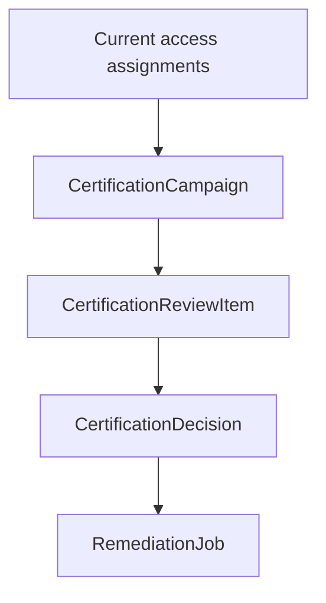
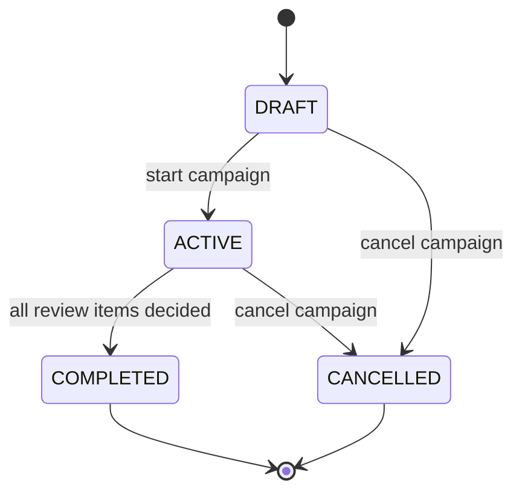
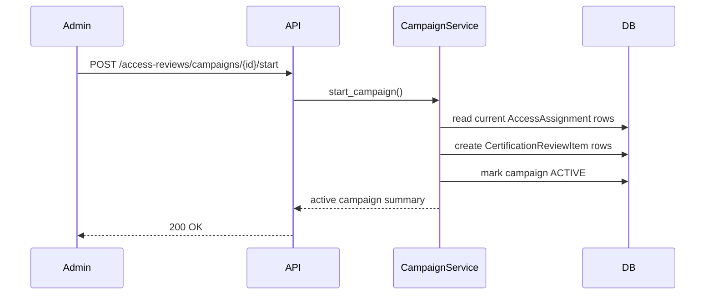
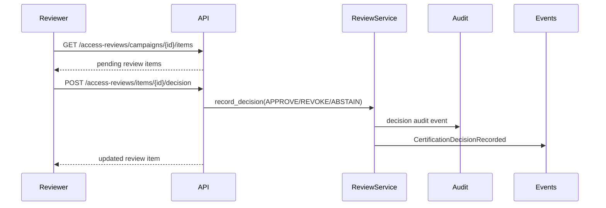
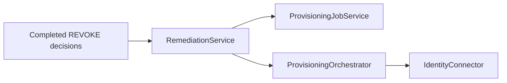

# Access Reviews And Certification Campaigns

Milestone 8A adds the governance foundation for AccessIQ. Access reviews are the certification workflow used by Identity Governance & Administration platforms to periodically ask reviewers whether users should keep access.

This layer records certification decisions. Remediation is a separate, explicit step after campaign completion so reviewers can certify access before any connector-backed action runs.

Access review routes receive their services through the shared FastAPI dependency providers in `app/dependencies.py`. This keeps route construction consistent with remediation, provisioning, and connector paths while leaving campaign and review business logic in `app/governance/services.py`.

## IGA Concepts

An access review campaign is a governance exercise over current access. A reviewer certifies each review item with one of three decisions:

- `APPROVE`: access is still appropriate.
- `REVOKE`: access should be removed by a future remediation workflow.
- `ABSTAIN`: reviewer cannot certify or revoke the access.

## Data Model

`CertificationCampaign` stores lifecycle and summary state:

- name and description
- status
- creator
- default reviewer
- timestamps for create/start/complete/cancel
- total item count
- completed item count
- approval, revocation, and abstain counts

`CertificationReviewItem` stores one access decision target:

- campaign
- access assignment
- user
- application
- entitlement
- optional group
- reviewer
- status
- reviewed timestamp

`CertificationDecision` stores the current decision for a review item:

- review item
- campaign
- reviewer
- decision
- comments
- create/update timestamps

The schema is normalized. No review item or decision payload is stored as a JSON blob.

## Campaign Lifecycle

Invalid transitions are rejected. Completed and cancelled campaigns no longer accept decisions.

## Review Generation

Starting a draft campaign snapshots current access assignments into review items.

Each generated item references the user, application, entitlement, access assignment, and assigned reviewer.

## Reviewer Workflow

Decision updates are supported while a campaign is active. Updating a decision recalculates campaign counts and publishes `CertificationDecisionUpdated`.

## APIs

Campaign endpoints:

- `POST /access-reviews/campaigns`
- `GET /access-reviews/campaigns`
- `GET /access-reviews/campaigns/{campaign_id}`
- `GET /access-reviews/campaigns/{campaign_id}/summary`
- `POST /access-reviews/campaigns/{campaign_id}/start`
- `POST /access-reviews/campaigns/{campaign_id}/cancel`
- `POST /access-reviews/campaigns/{campaign_id}/complete`

Review item endpoints:

- `GET /access-reviews/campaigns/{campaign_id}/items`
- `GET /access-reviews/items/{item_id}`
- `POST /access-reviews/items/{item_id}/decision`

Read endpoints require `security_admin`, `iam_admin`, or `auditor`. Campaign lifecycle mutations require `security_admin` or `iam_admin`. Decision recording allows `security_admin`, `iam_admin`, or `auditor`.

## Audit And Domain Events

Campaign lifecycle actions create audit events using the seeded `Governance` application and `Access Review Certification` entitlement. Decision audit events use the actual application and entitlement being reviewed.

Audit actions:

- `certification_campaign_created`
- `certification_campaign_started`
- `certification_campaign_cancelled`
- `certification_campaign_completed`
- `certification_review_approved`
- `certification_review_revoked`
- `certification_review_abstained`
- `certification_decision_updated`

Domain events:

- `CertificationCampaignCreated`
- `CertificationCampaignStarted`
- `CertificationCampaignCompleted`
- `CertificationCampaignCancelled`
- `CertificationDecisionRecorded`
- `CertificationDecisionUpdated`

Audit events inherit the request correlation ID when no explicit operation correlation ID is supplied.

## Future Remediation

Milestone 8B adds explicit remediation for completed campaigns. Remediation consumes `REVOKE` decisions and executes provisioning through the existing connector orchestrator:

`APPROVE` and `ABSTAIN` decisions are skipped. Remediation requires a completed campaign and creates one normalized `RemediationJob` per remediable review item. The job links back to the generated `ProvisioningJob` through a shared correlation ID.
