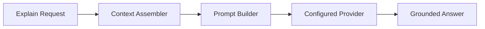
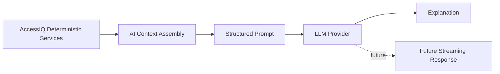

# AI Explanation Assistant

AccessIQ includes a grounded AI explanation assistant. It prepares graph-backed evidence, builds structured prompts, and asks a configured provider to explain only the deterministic evidence supplied by AccessIQ.

The AI layer must not:

- make authorization decisions
- grant access
- revoke access
- provision resources
- perform governance actions
- mutate AccessIQ state
- invent evidence

The implementation does not use embeddings, pgvector, or semantic search.

## Architecture

```mermaid
flowchart LR
    Question["User Question"]
    Intent["Intent Classifier"]
    Graph["Authorization Graph Query Engine"]
    Collect["Evidence Collection"]
    Merge["Merge And Deduplicate"]
    Rank["Evidence Ranking"]
    Budget["Approximate Token Budget"]
    Context["Context Assembly"]
    Prompt["Prompt Builder"]
    Provider["LLM Provider"]
    Response["Grounded Response"]
    API["REST API"]

    Question --> Intent
    Intent --> Graph
    Graph --> Collect
    Collect --> Merge
    Merge --> Rank
    Rank --> Budget
    Budget --> Context
    Context --> Prompt
    Prompt --> Provider
    Provider --> Response
    Response --> API
```



Package layout:

- `app/ai/models.py`: request, intent, evidence, token budget, context, and prompt models.
- `app/ai/intents.py`: rules-based question classifier.
- `app/ai/evidence.py`: graph evidence collection, merging, and deduplication.
- `app/ai/ranking.py`: deterministic evidence ranking.
- `app/ai/budget.py`: approximate token counting and evidence trimming.
- `app/ai/context.py`: context assembly orchestration.
- `app/ai/prompt.py`: structured prompt generation.
- `app/ai/providers/base.py`: provider interface and provider exceptions.
- `app/ai/providers/mock.py`: deterministic no-network explanation provider.
- `app/ai/providers/openai.py`: optional OpenAI adapter.
- `app/ai/providers/anthropic.py`: optional Anthropic adapter.
- `app/ai/explanation.py`: explain/chat service orchestration.
- `app/ai/conversation.py`: in-memory conversation store.
- `app/ai/config.py`: AI and provider environment settings.
- `app/ai/routes.py`: protected REST endpoints.

## Intent Detection

The intent classifier uses explicit parsing rules. It normalizes the question, matches known phrases and keywords, and extracts simple IDs such as `user 1`, `application 2`, and `entitlement 3` when request fields do not provide them.

Supported intents:

- `explain_access`
- `access_gap`
- `provisioning`
- `remediation`
- `review`
- `access_path`
- `manager_chain`
- `general`

No model, embedding, or semantic search is involved.

## Evidence Collection

The context assembler reuses the authorization graph query engine. Depending on the detected intent and request fields, it collects evidence for:

- user access
- access paths
- missing path checks
- application and entitlement nodes
- manager chains
- access review history
- remediation history
- provisioning history

Evidence is normalized into a consistent AI evidence model containing:

- `id`
- `evidence_type`
- `title`
- `description`
- `reference`
- `timestamp`
- `correlation_id`
- `relationship_type`
- graph node or edge identifiers when available
- distance, priority, rank score, and token estimate

Duplicate evidence is removed by evidence type, title, description, reference, and correlation ID. If duplicate evidence has better priority or graph distance, the stronger item is retained.

## Evidence Ranking

Ranking is deterministic. It uses fixed heuristics:

- relationship type priority
- intent-specific boosts
- graph distance
- timestamp presence
- stable tie breakers

Examples:

- `HAS_ENTITLEMENT` is prioritized for access explanations.
- `PROVISIONED_BY` is prioritized for provisioning questions.
- `REMEDIATED_BY` is prioritized for remediation questions.
- `REVIEWED_IN` is prioritized for review questions.
- `MANAGED_BY` is prioritized for manager chain questions.

The ranking layer does not learn, train, or call external services.

## Token Budgeting

AccessIQ uses an approximate token budget based on character count. This avoids tokenizer dependencies while keeping output size deterministic and testable.

The budget layer:

- reserves space for instructions and the user question
- estimates evidence token cost
- keeps highest-ranked evidence first
- omits lowest-ranked evidence when the budget is exceeded
- reports included count, omitted count, estimated tokens, and truncation status

## Prompt Building

The prompt builder returns a structured JSON object. It includes:

- system instructions
- original user question
- assembled evidence
- citations
- constraints
- future-provider-ready messages

The system instructions require the future provider to use only supplied evidence, cite references, and avoid authorization, provisioning, governance, or policy decisions.

## Provider Architecture

Providers implement the `LLMProvider` interface:

- `generate()`
- `health()`
- `provider_name()`
- `metadata()`

The interface is designed so streaming can be added later without changing the context or prompt pipeline.

Supported providers:

- `mock`: deterministic provider used by tests and local development.
- `openai`: optional provider. Missing `OPENAI_API_KEY` reports `configuration_missing`.
- `anthropic`: optional provider. Missing `ANTHROPIC_API_KEY` reports `configuration_missing`.

The mock provider produces an answer entirely from ranked evidence and citations. It never uses the network.

## Explanation Service

The explanation service runs:



Responses include:

- answer
- citations
- evidence
- provider metadata
- timing
- intent
- assembled context

Provider errors are mapped to consistent REST responses:

- missing configuration or unavailable provider: `503`
- timeout: `504`
- rate limit: `429`
- provider failure: `502`
- unknown provider: `404`

## Conversation Model

Chat is in-memory only. A conversation contains:

- `conversation_id`
- messages
- metadata
- `created_at`
- `updated_at`

`POST /ai/chat` stores the user question and the assistant's grounded answer. It does not persist data to the database.

## REST API

All AI context endpoints require one of:

- `security_admin`
- `iam_admin`
- `auditor`

Endpoints:

- `POST /ai/context`: classify the question, assemble ranked evidence, and return context.
- `POST /ai/evidence`: return ranked, deduplicated evidence and citations.
- `POST /ai/prompt`: return context plus a structured prompt object.
- `POST /ai/explain`: return provider-backed grounded explanation.
- `POST /ai/chat`: append to an in-memory grounded explanation conversation.
- `GET /ai/providers`: return provider health and metadata.

Example request:

```json
{
  "question": "Why does this user have access to Salesforce?",
  "user_id": 1,
  "application_id": 1,
  "entitlement_id": 1,
  "provider": "mock",
  "max_tokens": 1200
}
```

## Configuration

Environment variables:

- `AI_ENABLED`: enables explanation endpoints. Default: `true`.
- `LLM_PROVIDER`: default provider. Default: `mock`.
- `AI_TIMEOUT`: provider timeout in seconds. Default: `30`.
- `AI_MAX_TOKENS`: provider output token budget. Default: `1200`.
- `OPENAI_API_KEY`: optional OpenAI API key.
- `ANTHROPIC_API_KEY`: optional Anthropic API key.

## Future Streaming

The provider interface exposes provider metadata for streaming support, but streaming responses are not implemented yet. Future streaming should remain downstream of deterministic context assembly:



Providers may explain evidence, but they must not become the source of truth for access, policy, provisioning, reviews, or remediation.
