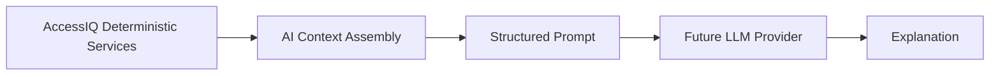

# AI Context Assembly

Milestone 12A adds a deterministic AI preparation layer. It prepares graph-backed evidence and structured prompt objects for future LLM integration.

It does not:

- call OpenAI
- call Anthropic
- call any LLM
- create embeddings
- use pgvector
- perform semantic search
- make authorization decisions
- mutate AccessIQ state

## Architecture

```mermaid
flowchart LR
    Question["User Question"]
    Intent["Intent Classifier"]
    Graph["Authorization Graph Query Engine"]
    Collect["Evidence Collection"]
    Merge["Merge And Deduplicate"]
    Rank["Evidence Ranking"]
    Budget["Approximate Token Budget"]
    Context["Context Assembly"]
    Prompt["Prompt Builder"]
    API["REST API"]
    Future["Future LLM Provider"]

    Question --> Intent
    Intent --> Graph
    Graph --> Collect
    Collect --> Merge
    Merge --> Rank
    Rank --> Budget
    Budget --> Context
    Context --> Prompt
    Prompt --> API
    API -. "not implemented in 12A" .-> Future
```



Package layout:

- `app/ai/models.py`: request, intent, evidence, token budget, context, and prompt models.
- `app/ai/intents.py`: rules-based question classifier.
- `app/ai/evidence.py`: graph evidence collection, merging, and deduplication.
- `app/ai/ranking.py`: deterministic evidence ranking.
- `app/ai/budget.py`: approximate token counting and evidence trimming.
- `app/ai/context.py`: context assembly orchestration.
- `app/ai/prompt.py`: structured prompt generation.
- `app/ai/routes.py`: protected REST endpoints.

## Intent Detection

The intent classifier uses explicit parsing rules. It normalizes the question, matches known phrases and keywords, and extracts simple IDs such as `user 1`, `application 2`, and `entitlement 3` when request fields do not provide them.

Supported intents:

- `explain_access`
- `access_gap`
- `provisioning`
- `remediation`
- `review`
- `access_path`
- `manager_chain`
- `general`

No model, embedding, or semantic search is involved.

## Evidence Collection

The context assembler reuses the authorization graph query engine. Depending on the detected intent and request fields, it collects evidence for:

- user access
- access paths
- missing path checks
- application and entitlement nodes
- manager chains
- access review history
- remediation history
- provisioning history

Evidence is normalized into a consistent AI evidence model containing:

- `id`
- `evidence_type`
- `title`
- `description`
- `reference`
- `timestamp`
- `correlation_id`
- `relationship_type`
- graph node or edge identifiers when available
- distance, priority, rank score, and token estimate

Duplicate evidence is removed by evidence type, title, description, reference, and correlation ID. If duplicate evidence has better priority or graph distance, the stronger item is retained.

## Evidence Ranking

Ranking is deterministic. It uses fixed heuristics:

- relationship type priority
- intent-specific boosts
- graph distance
- timestamp presence
- stable tie breakers

Examples:

- `HAS_ENTITLEMENT` is prioritized for access explanations.
- `PROVISIONED_BY` is prioritized for provisioning questions.
- `REMEDIATED_BY` is prioritized for remediation questions.
- `REVIEWED_IN` is prioritized for review questions.
- `MANAGED_BY` is prioritized for manager chain questions.

The ranking layer does not learn, train, or call external services.

## Token Budgeting

AccessIQ uses an approximate token budget based on character count. This avoids tokenizer dependencies while keeping output size deterministic and testable.

The budget layer:

- reserves space for instructions and the user question
- estimates evidence token cost
- keeps highest-ranked evidence first
- omits lowest-ranked evidence when the budget is exceeded
- reports included count, omitted count, estimated tokens, and truncation status

## Prompt Building

The prompt builder returns a structured JSON object. It includes:

- system instructions
- original user question
- assembled evidence
- citations
- constraints
- future-provider-ready messages

The system instructions require the future provider to use only supplied evidence, cite references, and avoid authorization, provisioning, governance, or policy decisions.

## REST API

All AI context endpoints require one of:

- `security_admin`
- `iam_admin`
- `auditor`

Endpoints:

- `POST /ai/context`: classify the question, assemble ranked evidence, and return context.
- `POST /ai/evidence`: return ranked, deduplicated evidence and citations.
- `POST /ai/prompt`: return context plus a structured prompt object.

Example request:

```json
{
  "question": "Why does this user have access to Salesforce?",
  "user_id": 1,
  "application_id": 1,
  "entitlement_id": 1,
  "max_tokens": 1200
}
```

## Future Provider Boundary

A future LLM provider can consume the prompt object produced by this layer. That provider should remain downstream of deterministic AccessIQ services:



The future provider may explain evidence, but it must not become the source of truth for access, policy, provisioning, reviews, or remediation.
