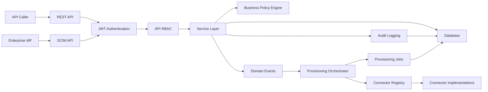
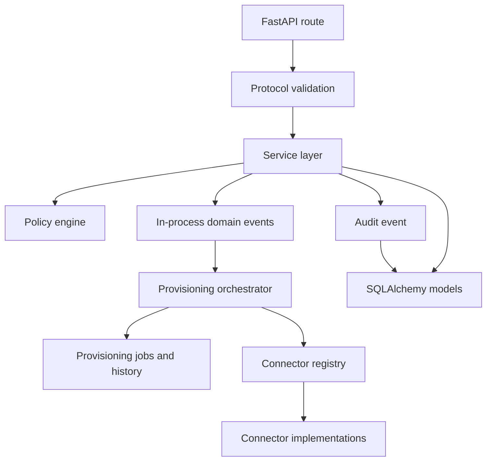
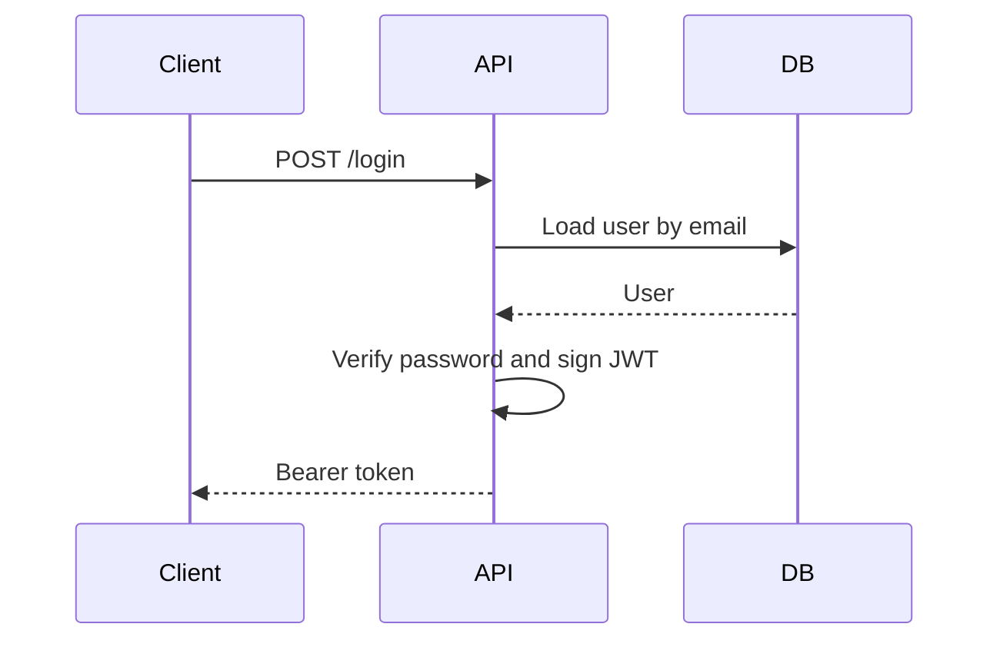
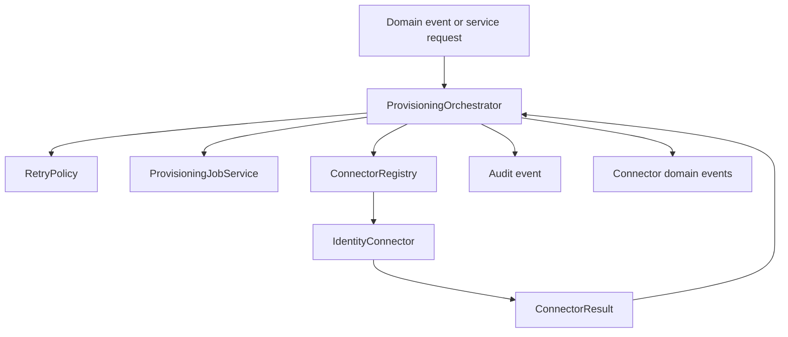
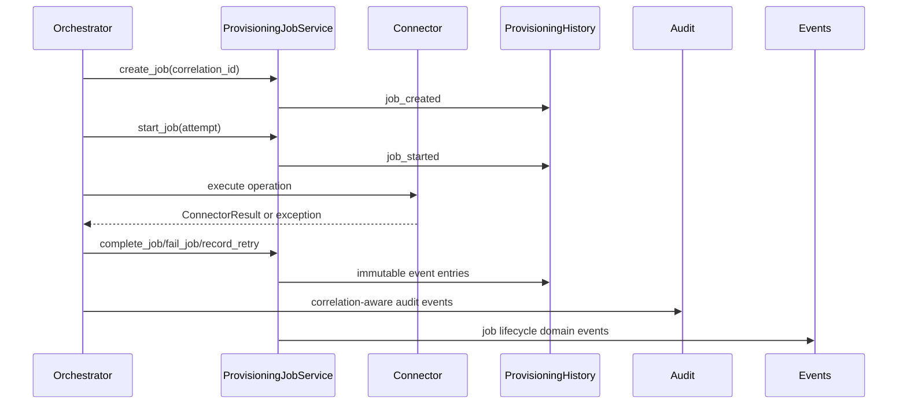
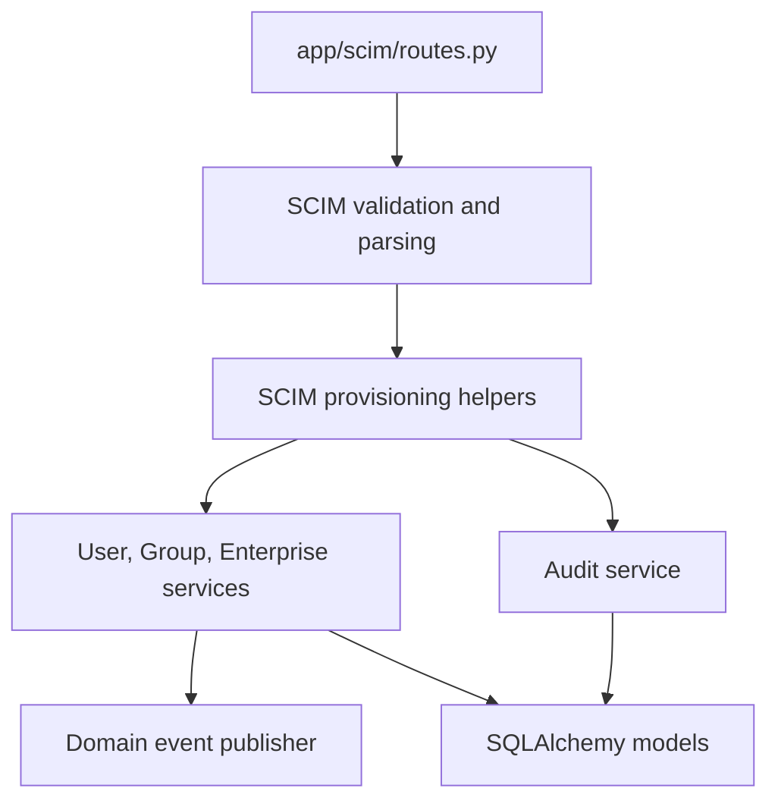
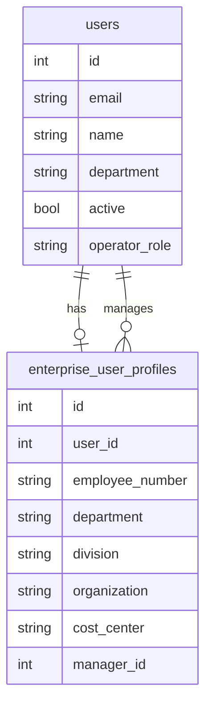
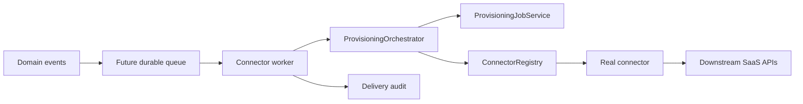
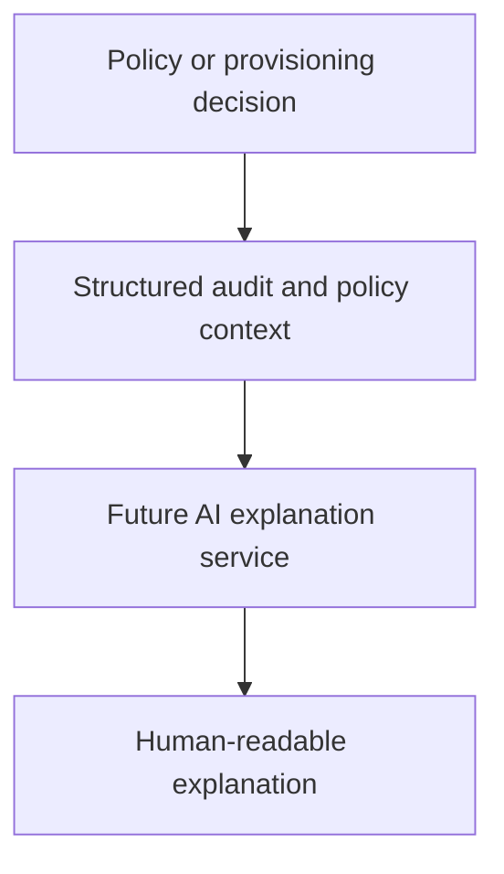

# AccessIQ Architecture

AccessIQ is a FastAPI IAM learning platform that models authentication, API RBAC, deterministic access policy, audit logging, and SCIM provisioning. The system is intentionally modular so future connector delivery, access reviews, and AI explanations can be added without rewriting the core API.

## System Overview

## Layered Architecture

AccessIQ keeps request handling, validation, business logic, audit, and persistence separated.

Routes should stay thin. They authenticate, authorize, parse request context, and delegate to protocol or service helpers. Business rules belong in services or policy modules.

## Authentication Flow

Users authenticate with `/login`. Passwords are verified using Argon2 through `passlib`, and successful login returns a signed JWT.

## API RBAC

API RBAC uses the `operator_role` field on `User`. Protected endpoints call reusable FastAPI dependencies such as `require_roles("security_admin", "iam_admin")`.

RBAC decides whether a caller may invoke an endpoint. It does not decide whether an access grant is appropriate. Business policy decisions are separate.

## Business Policy Engine

The policy engine evaluates access grant and revoke requests after API RBAC succeeds. Current policies cover inactive users, requester eligibility, finance restrictions, and administrator entitlement rules.

This keeps endpoint authorization distinct from entitlement policy.

## Audit Logging

Audit events are persisted in the same transaction as the operation they describe. If audit logging fails during provisioning, the database mutation rolls back and the API returns a SCIM-shaped server error for SCIM requests.

Audit events store:

- requester
- target user
- action
- application
- entitlement
- result
- reason
- timestamp

## Service Layer

Reusable services own mutation logic:

- `UserService`: user creation, replacement, patching, deactivation, duplicate userName checks.
- `GroupService`: group creation, replacement, patching, membership validation.
- `EnterpriseUserService`: enterprise profile mutation, employeeNumber uniqueness, manager validation, cycle prevention.
- `ProvisioningJobService`: provisioning job lifecycle, immutable history, retry tracking, and query filtering.

Services do not know FastAPI request objects. SCIM provisioning helpers translate protocol payloads and service errors into SCIM responses.

## Connector Framework

The connector framework is isolated under `app/connectors`. It provides production-style extension points for future outbound provisioning without integrating with external SaaS APIs in this milestone.

Current mock connector implementations are deterministic:

- Salesforce
- GitHub
- Zendesk
- Finance

They implement user lifecycle, group lifecycle, group membership, entitlement grant/revoke, and health check operations. Simulation modes cover success, validation failure, timeout, rate limiting, retryable failure, non-retryable failure, degraded health, and unavailable health.

## Provisioning Job Engine

The provisioning job engine persists connector execution state without introducing asynchronous processing.

`ProvisioningJob` is the current state record. `ProvisioningHistory` is append-only operational history. `AuditEvent.correlation_id` links job tracking to audit inspection.

## SCIM Architecture

SCIM is isolated under `app/scim`.

Supported SCIM surfaces:

- ServiceProviderConfig
- ResourceTypes
- Schemas
- User read and provisioning
- Group read and provisioning
- Enterprise User Extension

SCIM errors use the `application/scim+json` media type and SCIM Error schema.

## Enterprise User Extension

Enterprise profile data is normalized in `EnterpriseUserProfile`.

Manager assignments must reference existing users. The service rejects self-manager assignments and manager cycles.

## Domain Events

Domain events are in-process only. They provide a clean seam for future connector delivery without introducing asynchronous infrastructure now.

Current event families include:

- user provisioned
- group created/updated
- group membership added/removed/replaced
- enterprise profile created/updated
- enterprise attributes changed
- manager changed
- connector called/succeeded/failed
- connector retry scheduled
- provisioning started/completed/failed
- provisioning job created/started/completed/failed
- provisioning retry recorded

## Future Connector Architecture

Future connector delivery can subscribe to domain events and dispatch outbound changes to SaaS applications through the same connector interface and orchestrator.

The current implementation intentionally does not include the queue, worker, or real SaaS API calls.

## Future AI Explanation Architecture

Future AI explanation work should consume deterministic system context rather than replace policy decisions.

The policy engine remains deterministic and authoritative.
