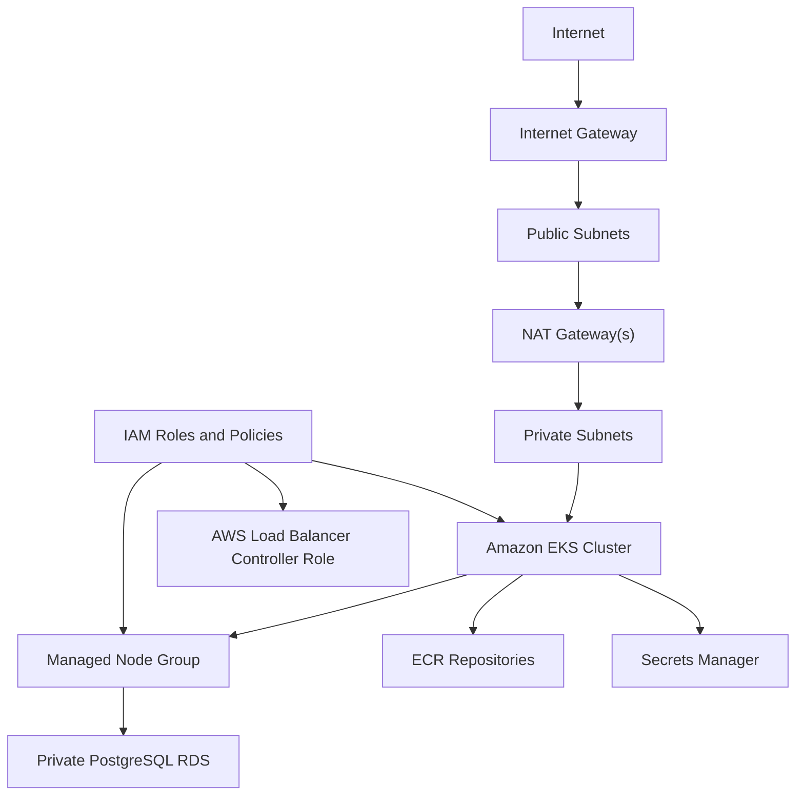

# AWS Infrastructure

Milestone 15A adds a Terraform foundation for running AccessIQ on AWS in a future deployment milestone. It provisions infrastructure only. It does not deploy the application to AWS, push container images, or configure GitHub Actions deployment.

## Architecture



The Terraform is organized under `infrastructure/terraform` with reusable modules and separate `dev` and `prod` environment roots. See [Terraform workflow](terraform.md) for remote state, backend bootstrap, planning, applying, destroying, and future CI guidance.

## Terraform Modules

- `modules/network`: VPC, public subnets, private subnets, Internet Gateway, NAT Gateway, public/private route tables, subnet tagging for Kubernetes load balancers.
- `modules/iam`: EKS cluster role, managed node role, AWS Load Balancer Controller IRSA role, and optional future GitHub Actions OIDC role.
- `modules/eks`: EKS cluster, managed node group, control plane log settings, endpoint access settings, and EKS OIDC provider.
- `modules/rds`: private PostgreSQL RDS instance, DB subnet group, parameter group, encrypted storage, automated backups, managed master password, and security group.
- `modules/ecr`: backend and frontend ECR repositories, scan-on-push, immutable tags, and lifecycle policies.
- `modules/secrets`: Secrets Manager secret shells for application and connector values.

## Environments

`environments/dev` uses lower-cost defaults:

- two Availability Zones
- one NAT Gateway
- two EKS nodes
- `t3.medium` node instances
- `db.t4g.micro` PostgreSQL
- RDS deletion protection disabled
- shorter ECR image retention

`environments/prod` uses production-oriented defaults:

- three Availability Zones
- one NAT Gateway per AZ
- three EKS nodes
- `t3.large` node instances
- Multi-AZ PostgreSQL
- RDS deletion protection enabled
- longer ECR image retention

Review all values before planning or applying in a real AWS account.

## Networking

The network module creates:

- one VPC
- public subnets for load balancers and NAT gateways
- private subnets for EKS nodes and RDS
- Internet Gateway
- NAT Gateway or NAT Gateways
- route tables and subnet associations

Subnets are tagged for Kubernetes load balancer discovery:

- `kubernetes.io/role/elb = 1`
- `kubernetes.io/role/internal-elb = 1`

## EKS

The EKS module creates:

- managed EKS cluster
- managed node group
- configurable Kubernetes version
- configurable API endpoint public/private access
- control plane logs for API, audit, and authenticator events
- EKS OIDC provider for IRSA

This milestone does not install Helm releases, ingress controllers, metrics-server, or application workloads.

## RDS

The RDS module creates PostgreSQL in private subnets with:

- encrypted gp3 storage
- AWS-managed master user password
- automated backups
- parameter group
- private security group ingress from EKS
- configurable instance class, storage, backup retention, Multi-AZ, and deletion protection

Production deployments should review backup retention, deletion protection, performance monitoring, maintenance windows, and final snapshot behavior before apply.

## ECR

The ECR module creates two repositories:

- backend
- frontend

Repositories use immutable tags, scan-on-push, AES256 encryption, and lifecycle rules for tagged and untagged images.

This milestone does not build or push Docker images.

## IAM

The IAM module creates least-privilege-oriented roles for:

- EKS control plane
- EKS managed nodes
- AWS Load Balancer Controller through IRSA
- future GitHub Actions OIDC use when explicitly enabled

The GitHub Actions OIDC role is disabled by default. Before enabling it, set allowed repositories and verify the OIDC thumbprints for the target AWS account workflow.

## Secrets

Secrets Manager resources are created as empty secret shells for:

- JWT signing secret
- database password placeholder
- OpenAI API key
- Anthropic API key
- connector credentials placeholder

Terraform intentionally does not write real secret values. Populate values out-of-band through the AWS console, AWS CLI, an external secret workflow, or a future deployment automation step.

RDS also creates an AWS-managed master user secret when the database is provisioned.

## Outputs

Each environment outputs:

- EKS cluster name
- EKS cluster endpoint
- VPC ID
- public subnet IDs
- private subnet IDs
- RDS endpoint
- RDS master user secret ARN
- ECR repository URLs
- Secrets Manager secret ARNs
- AWS Load Balancer Controller role ARN
- future GitHub Actions role ARN when enabled

## Validation

Run formatting from the repository root:

```bash
terraform fmt -recursive infrastructure/terraform
```

Before the remote backend has been bootstrapped, run static validation from an environment directory:

```bash
terraform init
terraform validate
```

After the S3 backend exists, copy `backend.tf.example` to `backend.tf`, create `backend.hcl` from `backend.example.hcl`, and initialize from the environment directory:

```bash
terraform init -backend-config=backend.hcl
terraform plan
```

Only run `terraform plan` when AWS credentials and region are configured. Do not run `terraform apply` until the cost and environment settings have been reviewed.

## Remote State

Each environment includes an example partial S3 backend and supplies real backend values through uncommitted bootstrap files:

- `environments/dev/backend.tf.example`
- `environments/dev/backend.example.hcl`
- `environments/prod/backend.tf.example`
- `environments/prod/backend.example.hcl`

Copy `backend.tf.example` to `backend.tf` and copy `backend.example.hcl` to `backend.hcl` during bootstrap. The examples use separate state keys for `dev` and `prod` and enable S3 native state locking with `use_lockfile = true`. The repository does not hardcode a state bucket name because the bucket must be globally unique and account-specific.

Bootstrap the S3 state bucket before running normal `terraform init -backend-config=backend.hcl`. Terraform does not create its own backend resources automatically in this repository.

## Estimated Costs

Actual costs depend on region and usage. The primary cost drivers are:

- EKS cluster hourly charge
- EC2 worker nodes
- NAT Gateways and data processing
- RDS PostgreSQL instance and storage
- cross-AZ data transfer
- ECR storage
- CloudWatch logs
- Secrets Manager monthly secret charges

The development environment is still not free because EKS, NAT Gateway, RDS, and EC2 nodes all create billable resources.

## Cleanup

From the environment directory:

```bash
terraform destroy
```

Destroy uses the same remote state backend as plan and apply. Before destroying production, confirm:

- RDS final snapshot expectations
- RDS deletion protection setting
- ECR image retention
- Secrets Manager recovery windows
- any manually created Kubernetes load balancers or volumes

If Kubernetes resources are deployed in a later milestone, remove application load balancers and persistent volumes before destroying the base infrastructure.
