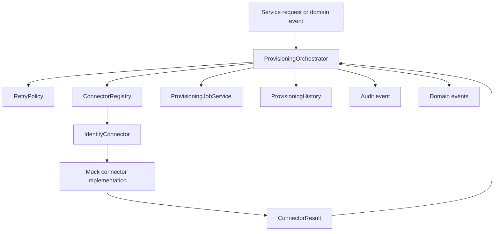
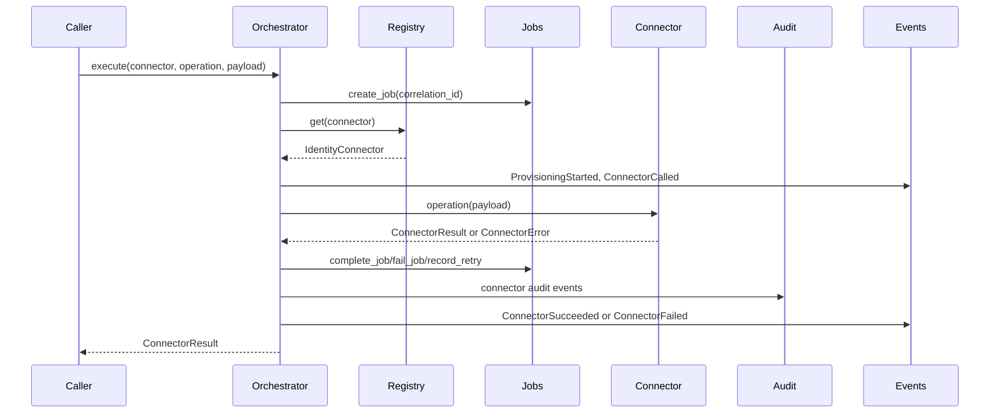
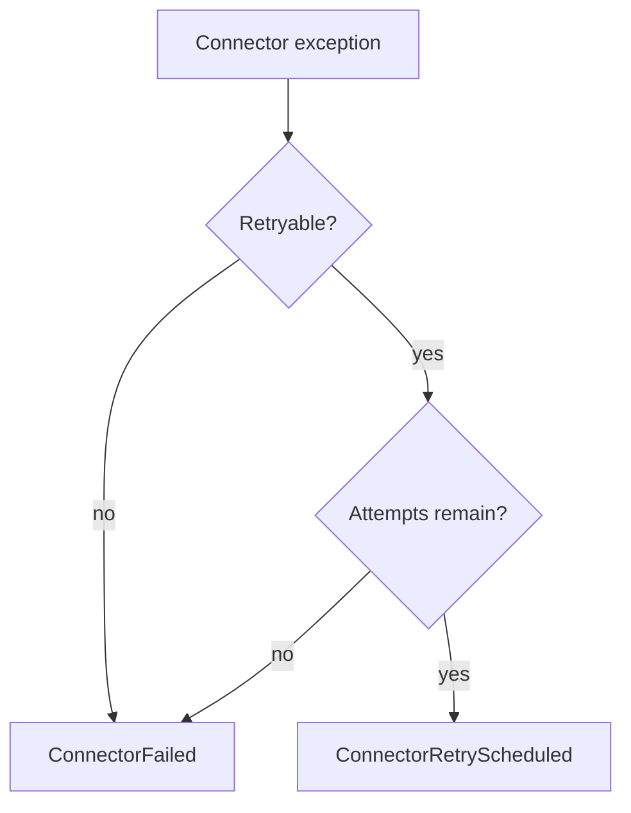

# Connector Framework

Milestone 7A adds the AccessIQ connector framework. It is a synchronous abstraction layer for future outbound provisioning and does not call any real SaaS APIs.

## Architecture

The framework is under `app/connectors`:

- `base.py`: `IdentityConnector` abstract base class.
- `results.py`: connector operations, statuses, health states, and structured results.
- `exceptions.py`: reusable connector exception hierarchy.
- `retry.py`: retry decision and backoff calculation.
- `registry.py`: connector registration and lookup.
- `orchestrator.py`: synchronous operation execution, audit, retry events, and result capture.
- `salesforce.py`, `github.py`, `zendesk.py`, `finance.py`: deterministic mock connectors.

## Connector Lifecycle

The orchestrator is synchronous. It does not enqueue work, sleep, or start background workers. When a database session is supplied, it persists provisioning jobs and immutable history. Future durable workers can subscribe to domain events and call the same orchestrator.

## Connector Interface

`IdentityConnector` defines these operations:

- `health_check`
- `create_user`
- `update_user`
- `disable_user`
- `delete_user`
- `create_group`
- `update_group`
- `delete_group`
- `add_group_member`
- `remove_group_member`
- `grant_entitlement`
- `revoke_entitlement`

Routes and services should resolve connectors through `ConnectorRegistry`; they should not instantiate connector classes directly.

## Connector Results

Connectors return `ConnectorResult` objects instead of booleans.

Fields:

- `connector`
- `operation`
- `status`
- `message`
- `timestamp`
- `duration_ms`
- `retryable`
- `correlation_id`
- `details`

Supported statuses:

- `SUCCESS`
- `FAILED`
- `RETRYABLE`
- `SKIPPED`

## Retry Policy

`RetryPolicy` decides whether an exception is retryable and calculates the next delay. It does not sleep.

Retryable exceptions include rate limits, timeouts, and other `RetryableConnectorError` subclasses.

## Mock Implementations

Current connectors are deterministic mocks:

- `SalesforceConnector`
- `GitHubConnector`
- `ZendeskConnector`
- `FinanceConnector`

They support simulation modes:

- `success`
- `validation_failure`
- `timeout`
- `rate_limit`
- `retryable_failure`
- `non_retryable_failure`
- `degraded`
- `unavailable`

No connector calls an external service.

## Health Checks

Every connector implements `health_check`.

Health states:

- `HEALTHY`
- `DEGRADED`
- `UNAVAILABLE`

Read-only administrative endpoints expose enabled connector metadata:

- `GET /connectors`
- `GET /connectors/{name}`
- `GET /connectors/{name}/health`

These endpoints require `security_admin`, `iam_admin`, or `auditor`.

## Configuration

Enabled connectors are controlled through environment variables:

- `ENABLE_SALESFORCE_CONNECTOR`
- `ENABLE_GITHUB_CONNECTOR`
- `ENABLE_ZENDESK_CONNECTOR`
- `ENABLE_FINANCE_CONNECTOR`

Future endpoint and credential variables are reserved:

- `SALESFORCE_API_BASE_URL`
- `GITHUB_API_BASE_URL`
- `ZENDESK_API_BASE_URL`
- `FINANCE_API_BASE_URL`

Milestone 7A stores these settings but does not use them to call external APIs.

## Audit

Connector executions use the seeded `Connector Framework` application and `Connector Execution` entitlement.

Audit actions:

- `connector_invocation`
- `connector_success`
- `connector_failure`
- `connector_retry_scheduled`
- `connector_provisioning_completed`

The orchestrator records audit events when a database session, requester ID, and target user ID are supplied.

Connector audit events include `correlation_id` when available, allowing audit rows to be tied back to `ProvisioningJob`, `ProvisioningHistory`, connector result data, and domain events.

## Domain Events

Connector execution publishes in-process events:

- `ProvisioningStarted`
- `ProvisioningCompleted`
- `ProvisioningFailed`
- `ConnectorCalled`
- `ConnectorSucceeded`
- `ConnectorFailed`
- `ConnectorRetryScheduled`
- `ProvisioningJobCreated`
- `ProvisioningJobStarted`
- `ProvisioningJobCompleted`
- `ProvisioningJobFailed`
- `ProvisioningRetryRecorded`

Events are not persisted. Future background workers can subscribe to these events without changing connector implementations.

## Future Real Connectors

Future real connectors should implement `IdentityConnector`, raise the shared connector exceptions, and return `ConnectorResult` objects. Authentication, rate limit handling, request signing, and API-specific validation should stay inside connector implementations; orchestration, retry decisions, audit, and event publishing should remain outside them.
