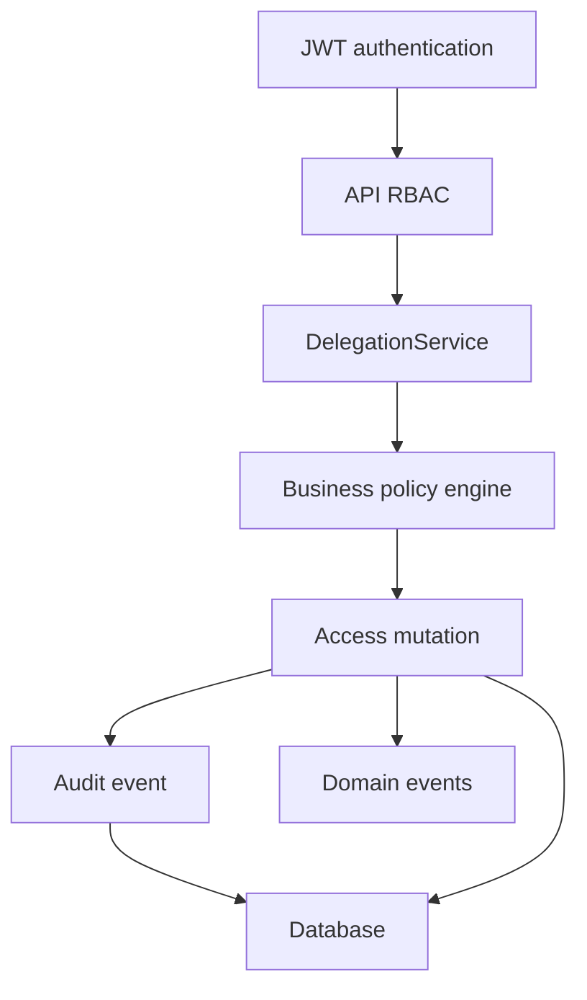
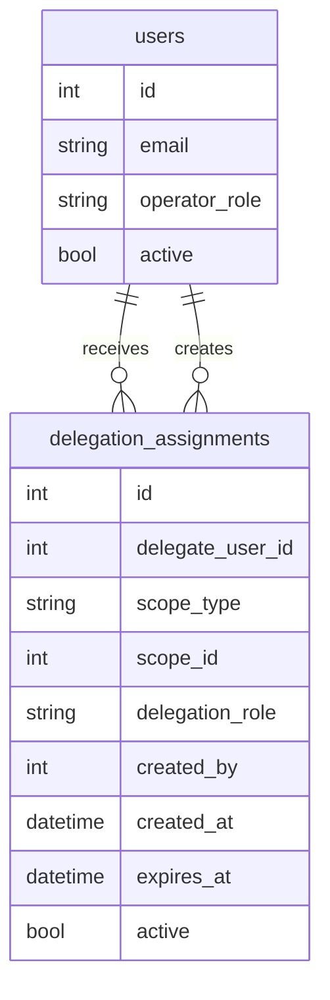
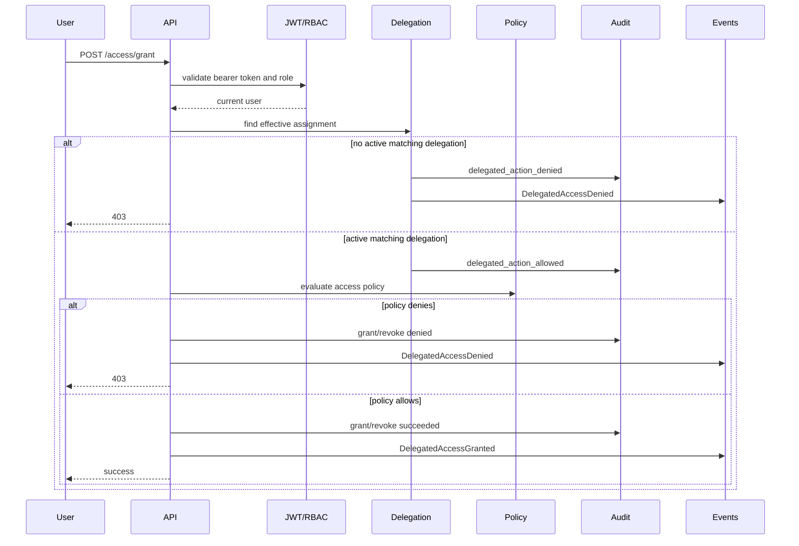

# Delegated Administration

Delegated administration lets AccessIQ scope administrative authority to specific applications, groups, and entitlements instead of requiring every operator to hold a global administrator role.

The feature is intentionally layered into the existing request flow:



Global `security_admin` and `iam_admin` users continue to work without a delegation assignment. Non-global users can perform delegated access actions only when an active, unexpired assignment matches the requested entitlement or its parent application. The business policy engine still runs after delegation succeeds.

## Delegation Assignment Model

`DelegationAssignment` is a normalized table with:

- `id`
- `delegate_user_id`
- `scope_type`
- `scope_id`
- `delegation_role`
- `created_by`
- `created_at`
- `expires_at`
- `active`

The uniqueness rule prevents duplicate active assignments for the same delegate, scope, and role.



## Scopes

Supported scopes:

- `APPLICATION`
- `GROUP`
- `ENTITLEMENT`

Designed future scopes:

- `DEPARTMENT`
- `ORGANIZATIONAL_UNIT`

Scope validation confirms the referenced application, group, or entitlement exists before an assignment is created.

## Delegation Roles

Supported roles:

- `APPLICATION_OWNER`
- `APPLICATION_ADMINISTRATOR`
- `GROUP_OWNER`
- `GROUP_ADMINISTRATOR`
- `ACCESS_REVIEWER`
- `HELPDESK_DELEGATE`

Current access grant/revoke integration recognizes application and entitlement scoped assignments for:

- `APPLICATION_OWNER`
- `APPLICATION_ADMINISTRATOR`
- `HELPDESK_DELEGATE`

Group roles are persisted and validated now so later SCIM group administration and approval workflows can reuse the same model.

## Authorization Flow



Delegation does not bypass policy. Finance Portal grants still require Finance target users. Administrator entitlement changes require `APPLICATION_OWNER` or `APPLICATION_ADMINISTRATOR` delegation.

## REST API

Create an assignment:

```bash
curl -X POST http://localhost:8000/delegation/assignments \
  -H "Authorization: Bearer <admin-jwt>" \
  -H "Content-Type: application/json" \
  -d '{
        "delegate_user_id": 2,
        "scope_type": "APPLICATION",
        "scope_id": 1,
        "delegation_role": "HELPDESK_DELEGATE",
        "expires_at": "2026-12-31T23:59:59Z"
      }'
```

List assignments:

```bash
curl "http://localhost:8000/delegation/assignments?active=true&count=50" \
  -H "Authorization: Bearer <admin-jwt>"
```

Lookup an assignment:

```bash
curl http://localhost:8000/delegation/assignments/1 \
  -H "Authorization: Bearer <admin-jwt>"
```

Remove an assignment:

```bash
curl -X DELETE http://localhost:8000/delegation/assignments/1 \
  -H "Authorization: Bearer <admin-jwt>"
```

## Audit And Events

Audit actions:

- `delegation_assigned`
- `delegation_removed`
- `delegated_action_allowed`
- `delegated_action_denied`

Domain events:

- `DelegationAssigned`
- `DelegationRemoved`
- `DelegatedAccessGranted`
- `DelegatedAccessDenied`

Assignment changes are audited against the delegated user as the target. Delegated access actions are audited against the user whose access is being changed.

## Future Organizational Delegation

Future milestones can add department and organizational unit scopes by extending the scope validator and matching logic. Approval workflows, access review ownership, notifications, compliance reports, and AI-powered governance explanations can consume the same normalized assignments and domain events.
