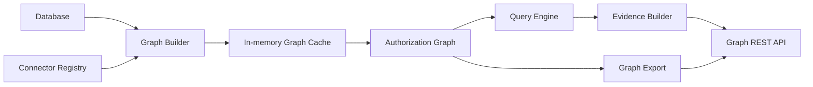

# Authorization Graph

Milestone 11A adds the AccessIQ authorization graph. The graph is a deterministic read model built from the relational database and connector registry.

It does not:

- replace SQLAlchemy models
- make authorization decisions
- provision resources
- call external APIs
- introduce AI behavior

Future AI explanation features can consume the graph, but this milestone keeps graph construction, traversal, evidence, and export fully deterministic.

## Architecture



Package layout:

- `app/graph/models.py`: node, edge, path, evidence, and cache response models.
- `app/graph/builder.py`: graph construction from existing database records.
- `app/graph/cache.py`: process-local cache with `load`, `refresh`, and `invalidate`.
- `app/graph/query.py`: deterministic lookup and traversal queries.
- `app/graph/evidence.py`: reusable evidence item generation.
- `app/graph/export.py`: JSON, Mermaid, and Graphviz DOT exports.
- `app/graph/routes.py`: protected graph API endpoints.

## Node Types

Supported graph nodes:

- `User`
- `Group`
- `Application`
- `Entitlement`
- `Delegation`
- `CertificationCampaign`
- `ReviewItem`
- `ProvisioningJob`
- `ProvisioningHistory`
- `RemediationJob`
- `AuditEvent`
- `Connector`
- `EnterpriseProfile`

Node IDs are deterministic and use the format:

```text
NodeType:source_id
```

Examples:

- `User:1`
- `Entitlement:4`
- `Connector:salesforce`

## Edge Types

Supported edge types:

- `MEMBER_OF`
- `HAS_ENTITLEMENT`
- `GRANTS_ACCESS_TO`
- `PROVISIONED_BY`
- `REVIEWED_IN`
- `REMEDIATED_BY`
- `MANAGED_BY`
- `DELEGATED_TO`
- `CONNECTED_TO`
- `AUDITED_BY`

Edges are directed for evidence, but shortest path traversal treats relationships as navigable in either direction so users can find how two graph nodes are connected.

## Query Engine

The query engine supports:

- `find_user`
- `find_group`
- `find_application`
- `find_entitlements`
- `find_access_path`
- `find_manager_chain`
- `find_review_history`
- `find_provisioning_history`
- `find_remediation_history`
- `find_delegations`
- `shortest_path`

The query engine only reads the cached graph. It does not query policies, mutate database state, or trigger provisioning.

## Evidence

Evidence objects use:

- `type`
- `title`
- `description`
- `reference`
- `timestamp`
- `correlation_id`

Evidence is generated from graph nodes and edges. Examples include access assignments, group memberships, manager relationships, delegated administration assignments, access review items, remediation jobs, provisioning history, and audit events.

## REST API

All graph endpoints require one of:

- `security_admin`
- `iam_admin`
- `auditor`

Endpoints:

- `GET /graph/users/{id}`
- `GET /graph/users/{id}/access`
- `GET /graph/users/{id}/evidence`
- `GET /graph/groups/{id}`
- `GET /graph/applications/{id}`
- `GET /graph/path`
- `GET /graph/export?format=json`
- `GET /graph/export?format=mermaid`
- `GET /graph/export?format=dot`
- `GET /graph/cache/status`
- `POST /graph/cache/refresh`
- `POST /graph/cache/invalidate`

## Cache

The graph cache is in memory and process-local.

- `load()` returns the current valid graph or builds one if needed.
- `refresh()` rebuilds the graph immediately.
- `invalidate()` marks the graph stale; the next `load()` rebuilds it.

Redis and durable cache infrastructure are intentionally out of scope. Future domain events can invalidate specific graph regions or trigger refresh workflows.

## Export

The graph can be exported as:

- JSON for API clients and tests
- Mermaid for documentation diagrams
- Graphviz DOT for debugging and graph visualization tooling

Exports are deterministic and generated from the cached graph.

## Future AI Usage

Future AI Explanation Assistant work can consume:

- graph paths
- evidence collections
- node and edge metadata
- exported graph fragments

The AI layer should not perform policy decisions directly. It should explain deterministic graph and policy outputs produced by AccessIQ.
