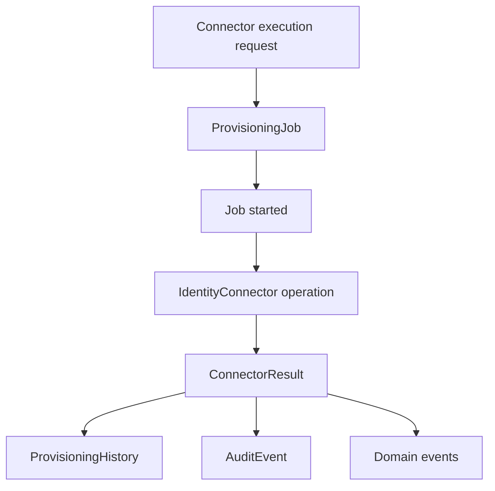
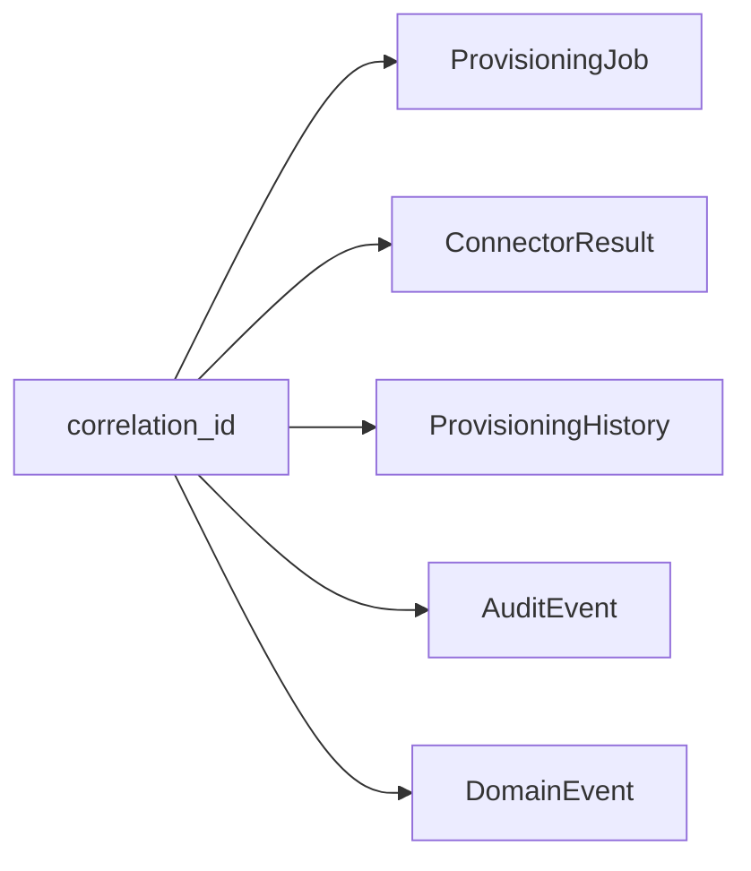
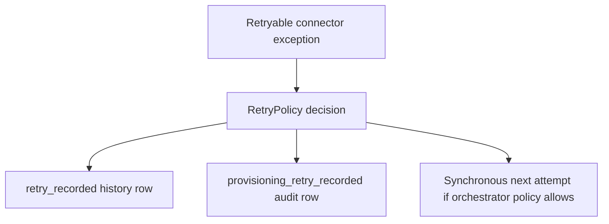
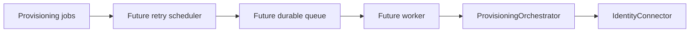

# Provisioning Jobs And History

Milestone 7B adds persistent provisioning jobs and immutable provisioning history. It is a tracking layer for connector execution, retry decisions, correlation IDs, audit, and future dashboards.

It does not add asynchronous processing, queues, background workers, scheduled retry execution, or real SaaS connector calls.

## Lifecycle

When `ProvisioningOrchestrator.execute()` receives a database session, it creates a job before connector execution and records history as the operation progresses.

## Job Model

`ProvisioningJob` stores the current state of a connector execution:

- `id`
- `correlation_id`
- `connector`
- `operation`
- `target_type`
- `target_id`
- `status`
- `attempt_count`
- `retry_count`
- `max_attempts`
- `retryable`
- `last_error`
- `created_at`
- `started_at`
- `completed_at`
- `duration_ms`

Job statuses use connector-aligned values such as `PENDING`, `RUNNING`, `SUCCESS`, `FAILED`, `RETRYABLE`, and `SKIPPED`.

## History Model

`ProvisioningHistory` stores immutable lifecycle entries:

- `job_created`
- `job_started`
- `connector_invocation`
- `connector_result`
- `retry_recorded`
- `job_completed`
- `job_failed`

History rows duplicate connector, operation, and correlation ID so operational timelines can be queried without rehydrating the job row first.

## Correlation IDs

Correlation IDs connect:

- `ProvisioningJob`
- `ProvisioningHistory`
- `ConnectorResult`
- `AuditEvent`
- connector domain events

If the caller does not supply a correlation ID, the orchestrator creates one.

## Retry Persistence

Retry decisions are recorded as job state and history. Milestone 7B does not schedule or execute future retries.

This gives future schedulers enough data to implement deferred retry execution later.

## Administrative APIs

Provisioning activity is exposed through read-only endpoints:

- `GET /provisioning/jobs`
- `GET /provisioning/jobs/{job_id}`
- `GET /provisioning/history`

All endpoints require `security_admin`, `iam_admin`, or `auditor`.

Job filters:

- `connector`
- `operation`
- `status`
- `correlation_id`
- `target_type`
- `target_id`

History filters:

- `job_id`
- `connector`
- `operation`
- `event_type`
- `status`
- `correlation_id`

Common pagination and sorting:

- `start_index`
- `count`
- `sort_by`
- `sort_order`

## Future Scheduler

Future asynchronous execution can build on this layer:

The current implementation intentionally stops at persistence and read-only inspection.
