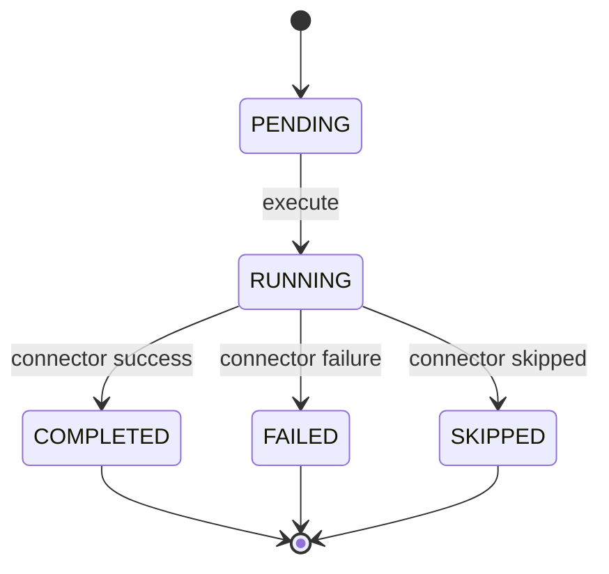
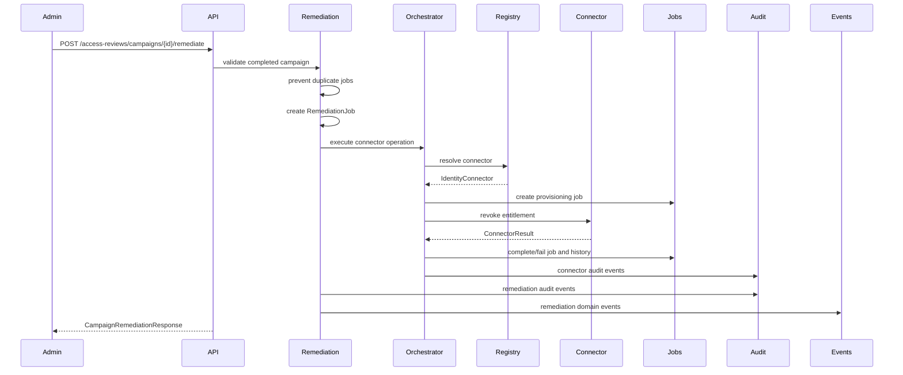
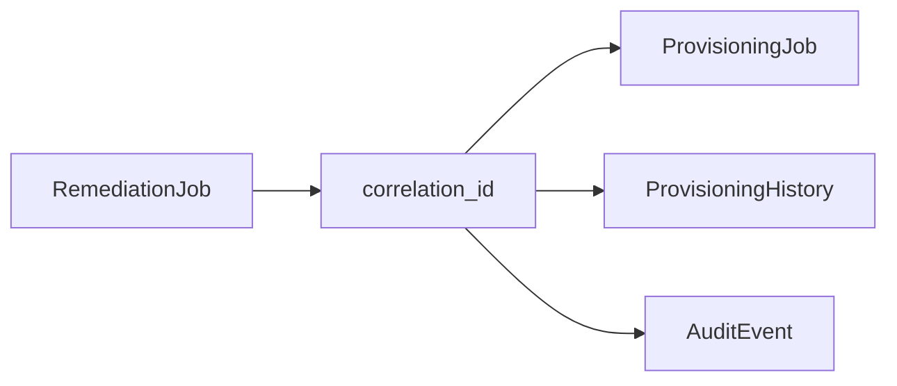
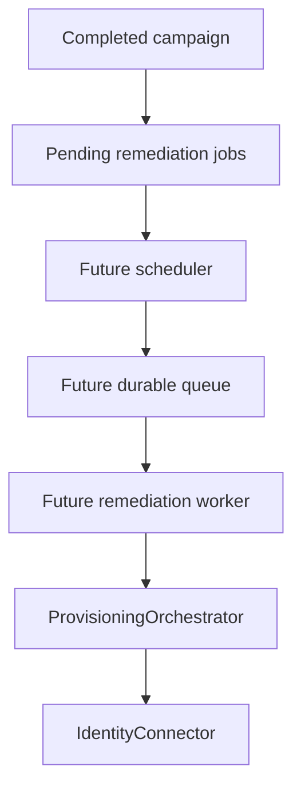

# Remediation Engine

Milestone 8B adds governance-driven remediation. It bridges completed access review decisions to the existing provisioning infrastructure.

The engine does not redesign authentication, RBAC, SCIM, connectors, provisioning jobs, or access reviews. It creates normalized remediation jobs and executes them through `ProvisioningOrchestrator`.

Remediation routes receive `RemediationService` through shared dependency providers. The provider injects the same connector registry path used by connector metadata and health endpoints.

## Lifecycle

`RemediationJob` stores:

- campaign
- review item
- linked provisioning job
- correlation ID
- remediation type
- status
- timestamps
- last error
- initiating operator

## Execution Flow

## Remediation Types

Supported types:

- `REVOKE_ENTITLEMENT`
- `REMOVE_GROUP_MEMBER`
- `DISABLE_USER`

Current access reviews generate entitlement-backed review items, so `REVOKE` decisions execute `REVOKE_ENTITLEMENT`. Group and user disable types are modeled for future review item shapes.

## Validation

The service rejects:

- unknown campaigns
- campaigns that are not `COMPLETED`
- unknown review items
- non-remediable decisions
- duplicate remediation jobs
- unmapped connector applications

`APPROVE` and `ABSTAIN` decisions are counted as skipped, not failed.

## APIs

- `POST /access-reviews/campaigns/{campaign_id}/remediate`
- `GET /remediation/jobs`
- `GET /remediation/jobs/{job_id}`

All endpoints require `security_admin` or `iam_admin`.

`GET /remediation/jobs` supports:

- `campaign_id`
- `review_item_id`
- `status`
- `remediation_type`
- `correlation_id`
- `start_index`
- `count`
- `sort_by`
- `sort_order`

## Provisioning Integration

Each remediation job uses the existing connector registry and provisioning orchestrator. The resulting provisioning job is linked back through `provisioning_job_id`, and the shared `correlation_id` connects:

- remediation job
- provisioning job
- provisioning history
- connector result
- audit events
- domain events

When a remediation request does not supply an operation-specific correlation ID, the service uses the active request context correlation ID before falling back to a generated UUID.

## Future Scheduler Architecture

Future asynchronous remediation can build on the same normalized jobs:

The current milestone intentionally executes synchronously from the API so the architecture remains easy to validate.
