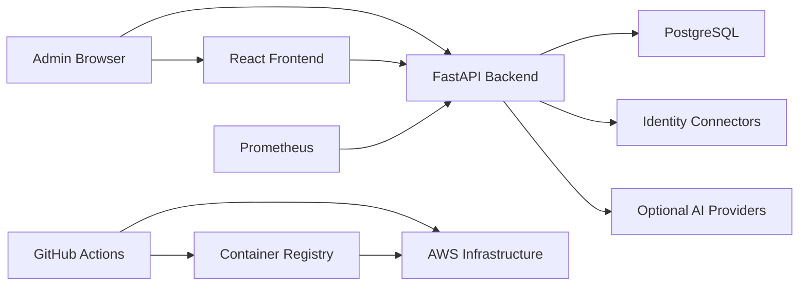
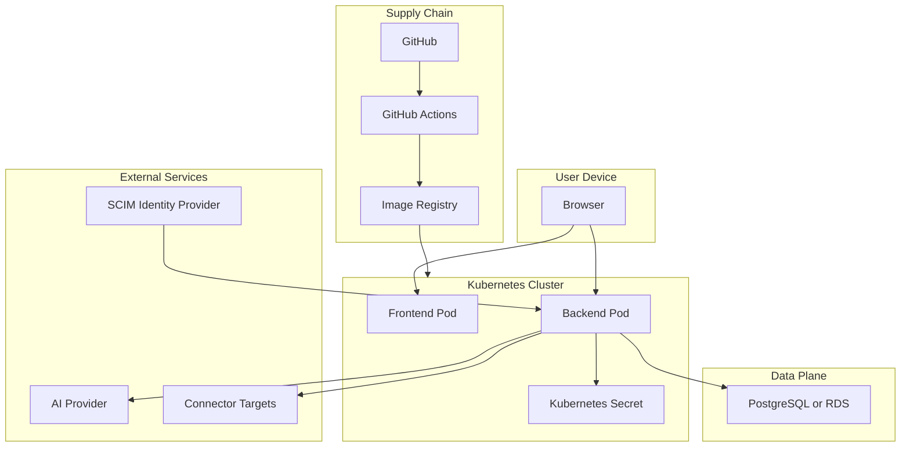
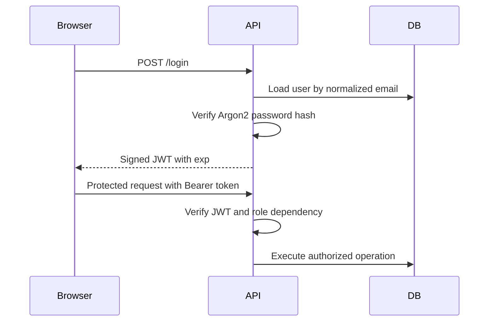

# Threat Model

This STRIDE threat model covers the AccessIQ application, frontend, API,
Kubernetes packaging, AWS deployment path, CI/CD pipeline, and supply chain
controls as of Milestone 16C.

## System Context

## Assets

- User identities, roles, departments, group memberships, and enterprise profile
  attributes.
- Access assignments, entitlements, and application metadata.
- JWT signing secret and issued bearer tokens.
- Audit events, provisioning jobs, remediation jobs, and access review decisions.
- Authorization graph exports and AI evidence bundles.
- Connector credentials and provider API keys.
- PostgreSQL data and backups.
- Container images, SBOMs, CI artifacts, and release metadata.
- Terraform state, Kubernetes Secrets, and AWS Secrets Manager entries.

## Actors

- Security administrators and IAM administrators.
- Auditors.
- Help desk users, managers, delegated operators, and employees.
- SCIM identity provider clients.
- CI/CD runners.
- Kubernetes control-plane and workload identities.
- External AI providers when enabled.
- Malicious users, compromised operators, compromised dependencies, and network
  attackers.

## Entry Points

- Browser frontend.
- REST API and OpenAPI documentation.
- SCIM API.
- `/metrics`, `/health`, and `/version`.
- Connector execution paths.
- AI context/explain/chat endpoints.
- Kubernetes ingress and services.
- GitHub Actions workflows.
- Dockerfiles, package manifests, Terraform modules, and Helm values.

## Trust Boundaries

## STRIDE Analysis

| Threat | Example | Current Mitigations | Residual Risk |
| --- | --- | --- | --- |
| Spoofing | Attacker uses forged bearer token. | JWT signature validation, expiration claims, user lookup, Argon2 password hashes. | JWT secret compromise would invalidate token trust until rotated. |
| Spoofing | Compromised GitHub runner assumes AWS role. | GitHub OIDC, no static AWS keys in workflow, scoped deploy inputs. | Production should restrict OIDC subject claims to protected branches/tags. |
| Tampering | Client submits access grant for another requester. | Requester is derived from JWT, not request body. Audit events record requester and target. | Database admin compromise can still tamper with records. |
| Tampering | Malicious dependency modifies build output. | pip-audit, npm audit, dependency review, SBOM generation, container scanning. | Dependency confusion and maintainer compromise require lockfile review and future provenance. |
| Repudiation | Operator denies making access change. | Audit events, provisioning history, remediation history, correlation IDs, structured logs. | External log retention and immutability are deployment responsibilities. |
| Information disclosure | Graph or AI evidence exposes identity relationships. | Graph and AI endpoints require admin/auditor roles. AI must explain deterministic evidence only. | Authorized users can export sensitive summaries; production should monitor and restrict exports. |
| Information disclosure | Metrics or API docs exposed publicly. | `/metrics` has no bearer token for Prometheus compatibility; docs are documented for restriction. | Ingress/network controls must restrict production access. |
| Denial of service | High traffic exhausts API or database connections. | Resource limits, probes, HPA values, SQLAlchemy pool controls, k6 validation. | Rate limiting is not bundled yet. |
| Denial of service | Connector or AI provider latency stalls requests. | Provider timeout settings, connector retry classification, health reporting. | Durable background workers are future work for high-volume production operations. |
| Elevation of privilege | Help desk user grants administrator entitlement. | RBAC, delegation checks, and business policy prevent unauthorized grants. | Public demo user creation should be restricted before internet exposure. |
| Elevation of privilege | Compromised pod reads cluster token. | ServiceAccount token automount disabled, non-root pods, dropped capabilities, read-only root filesystems. | Admission controls and runtime detection should be added in production clusters. |

## Data Flow Threats

### Login And API Authorization

Key risks are credential stuffing, token theft, weak JWT secret, and overly broad
roles. Current mitigations are password hashing, short-lived tokens, role
dependencies, policy checks, and audit logging. Production should add rate
limiting and external identity provider integration.

### SCIM Provisioning

SCIM routes are high-impact because they can create and update users and groups.
Current mitigations are admin-only RBAC, SCIM validation, normalized persistence,
transaction rollback, audit events, and domain events. Production deployments
should restrict SCIM ingress to known identity-provider networks where possible.

### AI Explanations

AI routes process sensitive evidence but do not make decisions. Current
mitigations are RBAC, deterministic context assembly, token budgets, provider
health checks, and mock default provider. Production deployments must manage
provider keys as secrets and treat prompts/responses as sensitive logs.

### CI/CD And Release

CI validates source, dependencies, containers, Kubernetes manifests, and SBOM
generation. Remaining future controls are Cosign/Sigstore image signing,
provenance attestations, and signature verification before production deploys.

## Mitigation Backlog

- Restrict public demo endpoints before exposing production to the internet.
- Add API rate limiting and lockout policy.
- Add external identity provider SSO.
- Add immutable audit log export.
- Add Cosign keyless signing and SBOM/provenance attestations.
- Add runtime security monitoring and admission-policy enforcement.
- Add connector credential vaulting and per-connector egress allow lists.
